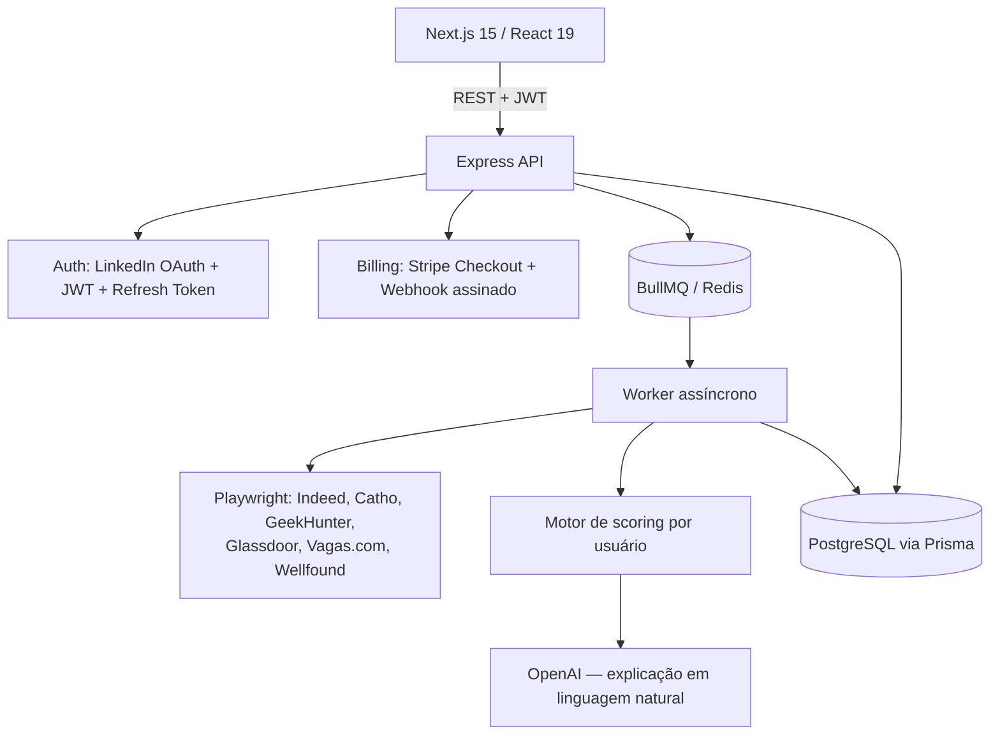
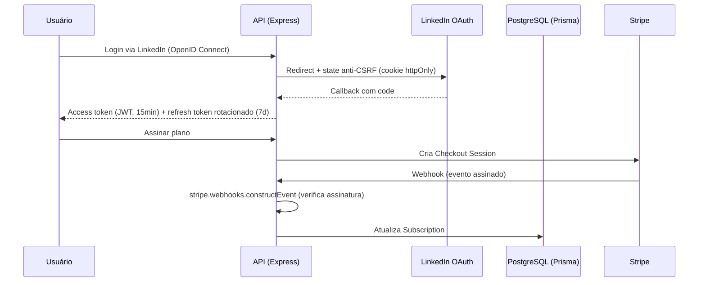
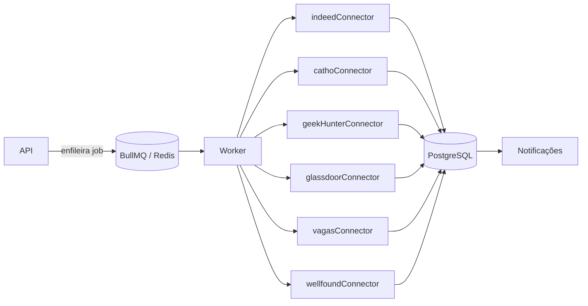

<div align="center">


**SaaS que centraliza vagas de múltiplas plataformas, pontua cada uma para o usuário com um modelo próprio + explicação por LLM, e cobra por assinatura via Stripe** — webhook com verificação de assinatura real, refresh token rotativo, filas assíncronas.

<p>


</p>

<p>
<a href="https://github.com/RobersonCodes"></a>
</p>

</div>

---

> **Nota de transparência**: esta reescrita segue o mesmo princípio do restante do portfólio — todo número aqui foi conferido no código (19 controllers, 20 arquivos de rota, 15 models Prisma). Há uma seção específica, [Automação e conformidade](#automação-e-conformidade), sobre módulos internos que **não são vendidos como recurso** nesta documentação por ainda não terem passado por revisão de conformidade com termos de uso de terceiros — ver essa seção antes de avaliar o projeto como "pronto para produção".

## Sumário

- [Visão geral](#visão-geral)
- [Stack tecnológica](#stack-tecnológica)
- [Arquitetura](#arquitetura)
- [Autenticação e billing](#autenticação-e-billing)
- [Fila assíncrona e agregação de vagas](#fila-assíncrona-e-agregação-de-vagas)
- [Motor de scoring](#motor-de-scoring)
- [Otimização de currículo para ATS](#otimização-de-currículo-para-ats)
- [Automação e conformidade](#automação-e-conformidade)
- [Setup local](#setup-local)
- [Deploy](#deploy)
- [Comparação com produtos consolidados](#comparação-com-produtos-consolidados)
- [Roadmap](#roadmap)
- [FAQ](#faq)
- [Licença](#licença)

---

## Visão geral

O **Oliveira Apply AI** agrega vagas de múltiplas plataformas (Indeed, Catho, GeekHunter, Glassdoor, Vagas.com, Wellfound), pontua cada uma com um modelo de scoring aprendido por usuário, gera explicação da pontuação via LLM, e cobra por assinatura com 4 planos via Stripe. Login via LinkedIn OAuth (OpenID Connect padrão, não automação).

**O que já é sólido, verificado no código:**
- Webhook do Stripe valida assinatura de verdade (`stripe.webhooks.constructEvent`), não é só um botão de checkout.
- Refresh token rotation implementado (`RefreshToken` model dedicado, JWT de acesso curto + refresh de 7 dias).
- `helmet` + `express-rate-limit` já presentes no backend — diferente do TireMax, aqui a base de segurança HTTP já existe.
- 19 controllers, 20 arquivos de rota, 15 models Prisma no total.

**O que falta, sem maquiagem:** zero testes automatizados e zero CI — o maior gap deste projeto, à frente de qualquer feature nova.

---

## Stack tecnológica

**Frontend:** Next.js 15 · React 19 · Tailwind CSS · Framer Motion · Shadcn/UI · Recharts · Zustand
**Backend:** Node.js · Express · TypeScript · Prisma · PostgreSQL · Redis · BullMQ · Playwright · OpenAI SDK · Stripe SDK
**Infra:** Docker · Vercel (frontend) · Railway (backend)

---

## Arquitetura



---

## Autenticação e billing



Login é **LinkedIn Login oficial** (`openid profile email`, fluxo OAuth padrão com `state` anti-CSRF em cookie `httpOnly`) — não automação de conta. `ENCRYPTION_KEY` no `.env` é usado para outra finalidade: credenciais armazenadas para os módulos de automação descritos na seção [Automação e conformidade](#automação-e-conformidade), não para o login.

---

## Fila assíncrona e agregação de vagas



Cada conector usa Playwright para ler listagens **públicas** de vagas dessas 6 plataformas (não requer login do usuário nelas) e normaliza para o schema interno (`Application`, `Automation`, `AutomationLog`).

---

## Motor de scoring

O "score de vaga" é um **modelo de pontuação linear/logístico com pesos aprendidos por usuário** (`UserNeuralModel`/`NeuralTrainingSample`/`NeuralPrediction` no schema — nomeado "neural" no código, mas a implementação é um classificador linear sobre features normalizadas, não uma rede neural profunda) combinado com uma chamada de LLM para gerar a explicação em linguagem natural. Chamo aqui pelo nome técnico correto, não pelo nome do módulo.

Features consideradas (`featureExtractor.ts`): porte e tipo da empresa, senioridade, modalidade (remoto/híbrido/presencial), faixa salarial normalizada, match de stack técnica com o perfil do usuário, densidade de keywords, tempo de vaga aberta. Os pesos são recalibrados por usuário conforme o histórico de candidaturas e resultados (`syncApplicationOutcome`).

---

## Otimização de currículo para ATS

Módulo `recruiterVision`: detecta qual ATS (Greenhouse, Lever, Workday, Gupy, Taleo, iCIMS, Breezy...) a vaga provavelmente usa a partir de padrões da URL/domínio, calcula um score estimado de compatibilidade do currículo com aquele ATS, e sugere/aplica ajustes de conteúdo e keywords via LLM — mesma categoria de recurso de ferramentas como Jobscan ou Teal, aplicado ao currículo do próprio usuário.

---

## Automação e conformidade

O backend também contém dois módulos experimentais que **não são apresentados como recurso comercial nesta documentação**, porque envolvem interação automatizada direta com o LinkedIn cujo enquadramento nos termos de uso da plataforma não foi avaliado:

- **`shadowApply`**: gera um perfil sintético para testar a receptividade de uma vaga antes do perfil real do usuário se candidatar.
- **`conexaoCirurgica`**: agenda uma sequência de interações (seguir, curtir, comentar, pedir conexão) ao longo de ~14 dias antes de uma candidatura.
- `automation.service.ts` inclui lógica para reduzir a detecção de automação pelo navegador headless.

Documentá-los aqui apenas para registro de auditoria do código, não como diferencial de produto — ambos ficam fora do roadmap até uma revisão de conformidade com os termos de uso do LinkedIn, e credenciais associadas a eles (`ENCRYPTION_KEY`) exigem o mesmo cuidado de qualquer segredo de produção.

---

## Setup local

```bash
git clone https://github.com/RobersonCodes/oliveira-apply-ai.git
cd oliveira-apply-ai

# Backend
cp backend/.env.example backend/.env
cd backend && npm install

# Sobe Postgres + Redis
docker-compose up -d postgres redis

npx prisma migrate dev
npx prisma db seed
npm run dev            # API em http://localhost:3001

# Frontend (novo terminal)
cd frontend
cp .env.example .env.local
npm install
npm run dev             # App em http://localhost:3000
```

Pré-requisitos: Node.js 18+, Docker, PostgreSQL 15, Redis 7.

---

## Deploy

```bash
# Produção via Docker Compose
docker-compose -f docker-compose.prod.yml up -d

# Frontend → Vercel
cd frontend && vercel deploy --prod

# Backend → Railway
railway up
```

Variáveis obrigatórias em produção: `DATABASE_URL`, `REDIS_URL`, `JWT_SECRET`/`JWT_REFRESH_SECRET`, `OPENAI_API_KEY`, `STRIPE_SECRET_KEY`/`STRIPE_WEBHOOK_SECRET`, `ENCRYPTION_KEY`, `LINKEDIN_CLIENT_ID`/`LINKEDIN_CLIENT_SECRET`.

---

## Comparação com produtos consolidados

| Dimensão | Oliveira Apply AI (este repo) | SaaS consolidado |
|---|---|---|
| Billing | ✅ Stripe com webhook assinado, 4 planos | ✅ |
| Auth | ✅ OAuth padrão + refresh rotation | ✅ |
| Segurança HTTP básica | ✅ helmet + rate limit | ✅ |
| Testes automatizados | ❌ Nenhum | ✅ |
| CI/CD | ❌ Não configurado | ✅ |
| Observabilidade | 🟡 Winston/morgan (logs), sem tracing | ✅ |
| Módulos de automação sensíveis | 🟡 Existem, não comercializados até revisão de conformidade | Depende — a maioria dos produtos consolidados evita esse território deliberadamente |

**O que falta para reduzir essa distância**: testes e CI são o gap mais simples de fechar. O mais importante estrategicamente é decidir o destino dos módulos de automação sensível — removê-los, isolá-los como opt-in avançado com termo de responsabilidade explícito, ou reescrevê-los sem as partes que dependem de evasão de detecção — antes de qualquer divulgação pública mais ampla do produto.

---

## Roadmap

- [ ] Testes automatizados (zero hoje) e CI via GitHub Actions
- [ ] Revisão de conformidade dos módulos `shadowApply`/`conexaoCirurgica` com os termos de uso do LinkedIn antes de qualquer decisão sobre mantê-los
- [ ] Observabilidade: tracing das chamadas a OpenAI/Stripe/filas BullMQ
- [ ] Documentação pública da API (OpenAPI/Swagger)

---

## FAQ

**Por que não tem CI/testes ainda?**
Porque não tem, de verdade — é o maior gap deste projeto.

**O "Neural" no nome dos módulos de scoring é uma rede neural?**
Não. É um modelo linear/logístico com pesos recalibrados por usuário, combinado com uma chamada de LLM para a explicação textual. O nome do módulo no código é "neural"; a técnica não é.

**Por que alguns módulos de automação não estão documentados como recurso?**
Porque envolvem interação automatizada direta com o LinkedIn (login, engajamento, perfis sintéticos) que não passou por revisão de conformidade com os termos de uso da plataforma. Prefiro registrar que existem no código a esconder, mas não vou apresentá-los como diferencial comercial enquanto essa revisão não acontecer.

---

## Licença

MIT — ver [`LICENSE`](LICENSE).

---

<div align="center">

Parte do portfólio de **[Roberson de Oliveira](https://github.com/RobersonCodes)** · Full-Stack Engineer


</div>
